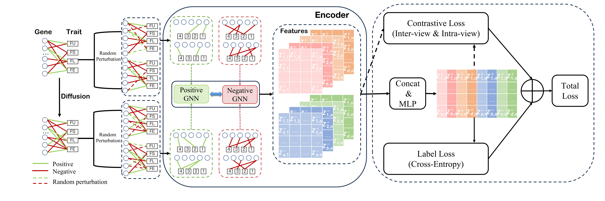
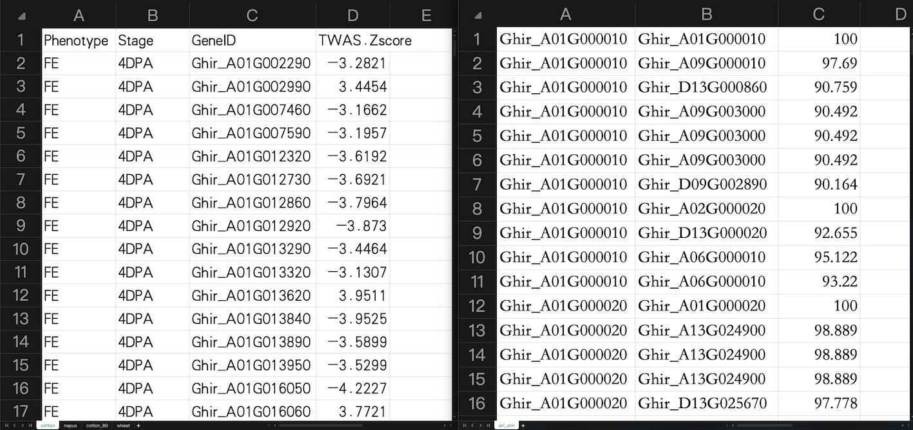

# CSGDN

<>

## Frameworks



## Abstract

Positive and negative association preidiction between gene and trait help studies for crops to perform complex physiological functions. The transcription and regulation activity of specific genes will be adjusted accordingly in different cell types, developmental stages, and physiological states to meet the needs of organisms. Determing gene-trait associations can resolve the mechanism of trait formation and benefit the improvement of crop yield and quality. There are the following two problems in obtaining the positive/negative associations between gene and trait: 1) High-throughput DNA/RNA sequencing and trait data collection are expensive and time-consuming due to the need to process large sample sizes; 2) experiments introduce both random and systematic errors, and, at the same time, calculations or predictions using software or models may produce noise. To address these two issues, we propose a <ins>**C**</ins>ontrastive <ins>**S**</ins>igned <ins>**G**</ins>raph <ins>**D**</ins>iffusion <ins>**N**</ins>etwork, **CSGDN**, to learn robust node representations with fewer training samples to achieve higher link prediction accuracy. CSGDN employs a signed graph diffusion method to uncover the underlying regulatory associations between genes and traits.  Then, stochastic perterbation strategies are used to create two views for both original and diffusive graphs. At last, a multi-view contrastive learning paradigm loss is designed to unify the node presentations learned from the two views to resist interference and reduce noise. We conduct experiments to validate the performance of CSGDN on three crop datasets: *Gossypium hirsutum*, *Brassica napus*, and *Triticum turgidum L.*. The results demonstrate that the proposed model outperforms state-of-the-art methods by up to 9.28\% AUC for link sign prediction in *Gossypium hirsutum* dataset.

## Dataset

There is no dataset provided in the code, if you want to use it, please download and calculate it yourself and put it into `data`, e.g. `data/TWAS.xlsx`

|data|data_name|
|:-:|:-:|
|Ghirsutum|<https://Ghirsutum.hzau.edu.cn/EN/Download.htm>|
|Brassica napus|/|
|Wheat|/|

For the node features (i.e. gene similarity matrix), please calculate them yourself and put them into `data/data_name/ori_sim.txt`, e.g. `data/cotton/ori_sim.txt`

Below is a diagram showing the format of our data:



## Usage

1. Generate data for the experiment

    When the dataset is ready, run

    ``bash
    python data_generator.py --dataset cotton
    ``

    The corresponding training, validation and test data of cotton will be obtained, and the corresponding node features and the graph after Diffusion will be generated automatically. If you want to change the threshold for the Diffusion operation, add it yourself to the function called in the last line of data_generator.py.

2. Training

    Run

    ```bash
    python train.py --dataset cotton
    ```

    to get the final result

We've set up a series of hyperparameters that can be tweaked

|hyperparameters|usage|default|
|:-:|:-:|:-:|
|alpha|--alpha|0.8|
|beta|--beta|0.01|
|feature_dim|--feature_dim|64|
|mask_ratio|--mask_ratio|0.4|
|predictor|--predictor|2|
|tau|--tau|0.05|
